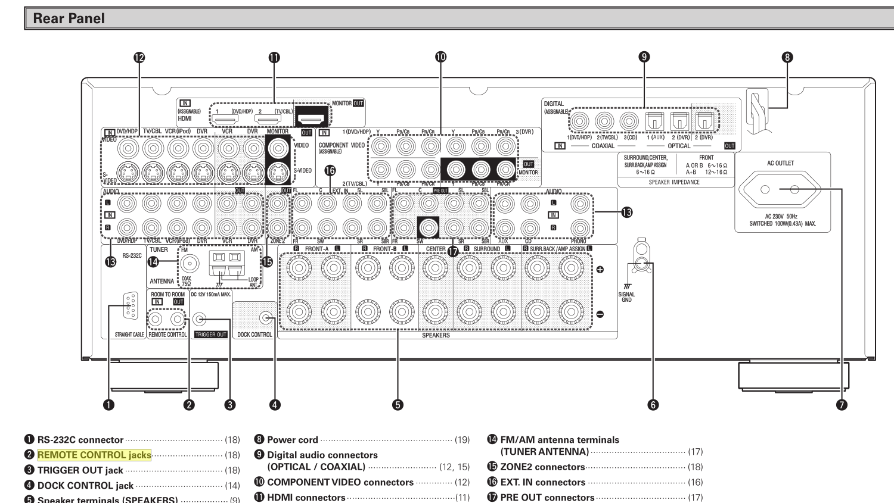

# IRDenon-ESP32

This is derived from https://github.com/aamarioneta/IRDenon

Web Interface to remote control a Denon AVR with an ESP32 and a infrared led or the Room to Room connection.


There are 4 ways to remote control older Denon AVR's (in my case Denon AVR 2308):
1. by remote: my AVR is inside a tv console and there is no line of sight.
2. by RS232: i managed to remote control it by connecting the COM Port of an old PC (which still has a COM port interface) and it worked perfectly. I just did not want another PC running. My first intention was to connect the ESP32 Serial port to the Denon COM Port but I just could not get it working.
3. Infrared extender / blaster (you can get one for 10-15€) but what's the fun in that? This repo can be used for emitting IR signals through a IR led.
4. Using the "Room to Room" "REMOTE CONTROL" or whatever it's called. Some AVR have the possibility to control other devices in other rooms for example. This is just a jack input for the same signals as for the IR led. This repo can also be used for emitting IR signals through the jack input without the need of a IR led. See your Denon manual



## Installation

### Hardware 

- For controlling a IR led (3) connect the NPN transistor and IR led as described here:
https://github.com/crankyoldgit/IRremoteESP32/wiki#ir-sending
- For controlling direct the "Room to Room" "REMOTE CONTROL": connect a 2 wire cable with a mono jack to ground and D2 on the ESP32. You can also use a mono headphone cable or a stereo headphone cable (just connect the 2 channels together).


### Software

- Copy `config.h.sample` to `config.h` and edit the SSID and password for your WiFi.
- You can also set a static IP (using `WIFI_IP` / `WIFI_GW` / `WIFI_MK`)
- You can also enable/disable the mDNS name (by default irdenon, comment to disable)
- Upload the INO file to the ESP32
- Upload the SPIFFS data to ESP32 (requires Arduino 1.0 and https://github.com/me-no-dev/arduino-esp32fs-plugin). Alternatively you can upload content manually (see Content update).

You can get the IP address of the ESP32 from the serial output or from your router. If you configured mDNS, you should be able to use irdenon.local for instance.

You can also send command directly through the API:
```http://irdenon.local/api/do?action=PWON```

## Content update

You can update contents without recompiling and restarting ESP32. This is valid for:
- HTML page (index.html)
- CSS styles (styles.css)

To upload the whole data folder:

```
cd data
for file in *; do curl -F "file=@$file" irdenon.local/api/upload; done
```

To upload a single file:

```
curl -F "file=@index.html" irdenon.local/api/upload
```

## IR Codes

You can test the IR led by looking at it with any phone camera, or by replacing the IR led with a normal led. It should blink when you use the web interface.

Currently only the basic functions implemented, but other codes can easly be read with a IR receiver diode, see for example here: https://github.com/crankyoldgit/IRremoteESP32/wiki#ir-receiving.

Also check https://github.com/aamarioneta/IRDenon/issues/4.
